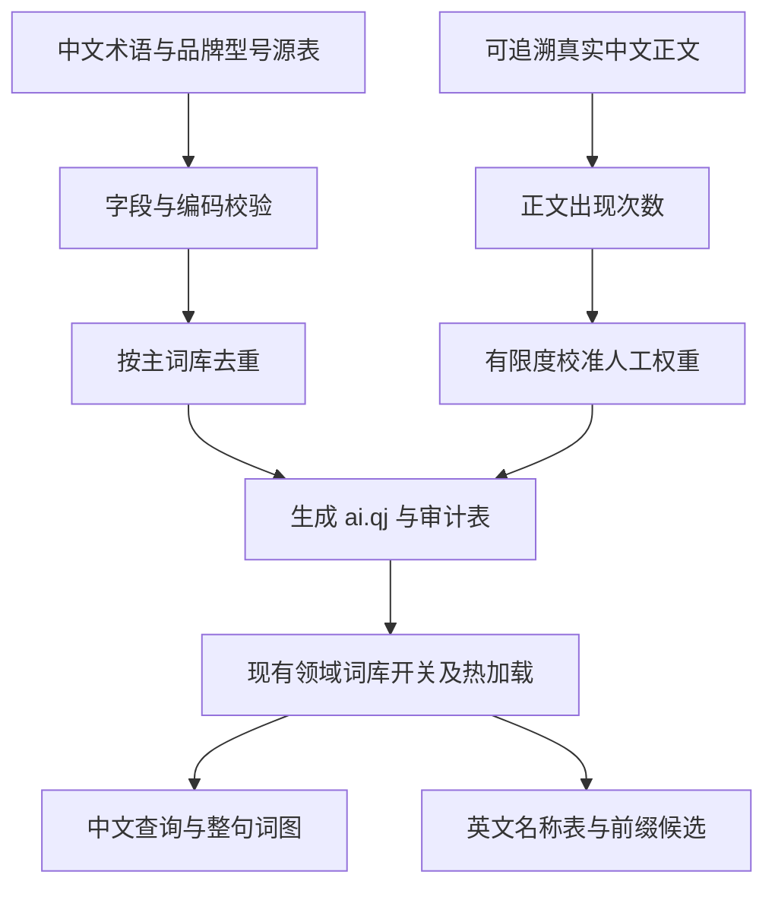

# AI 领域词库

AI 技术写作需要完整术语、固定搭配、厂商品牌与模型名称。它们独立于主词库维护，通过已有领域开关 `ai` 启用，默认关闭。

## 概念与规则

术语是可整块输入的中文词形；品牌、系列与具体型号是独立名称，实体字段表示关联。词条源保留分类、读音、人工权重、来源与核对日期。
语料是公开许可下的真实正文，支持权重统计与后续评测，不能用模型生成的句子冒充自然语料。

中文使用逐字拼音，复用全拼、简拼、双拼与繁体输出。英文名称以官方大小写和标点显示，输入码去除空格与标点，支持英文前缀补全。
型号不是最新产品推荐；官方 URL 和核对日期构成更新依据。只与主词库去重，保留与可选 IT 词库的重叠，确保独立启用可用。

## 实现

`tools/dict-convert/src/ai/` 校验八列 TSV、重复词与编码、规范音节和权重，遇错返回源文件及行号；校验通过才写词库。
审计表分列保存人工权重和正文次数。正文次数为非重叠子串匹配，保留段落边界，不等同于分词后一元频率；最终权重为人工权重与封顶 200 的正文次数的较大值。
这里仅影响词库静态权重，不改通用语言模型和个人学习数据。

英文词目使用 `@` 专用键，例如 `Claude Opus 5 / @claudeopus5`。`WordList::from_dictionaries` 只抽取匹配该约定的 ASCII 名称。
`Engine::set_extra_dictionaries` 同步重建英文表并清除查询格子缓存。个人英文表优先于领域表，领域表优先于主英文表；关闭领域表不清除个人已学习或其他词表已有的名称。
普通导入词库的未标记英文词不自动改变语义，混合词仍走中文候选。

平台沿用现有目录枚举、配置热加载和 `dicts/*.qj` 打包；不在平台壳中新增排序或词库访问逻辑。许可证与来源声明随三平台安装包分发。
数据发布脚本生成 AI 词库，新数据包发布后各平台才能在正式包里获得它；修改代码本身不等于已发布数据包。

## 维护与验证

真实正文的一元与相邻词统计复用已有 `bigram` 工具，输出到独立 `data/generated/ai-corpus/`；合并实验词表的步骤见词库源说明，不覆盖产品数据。

数据字段、来源、许可及命令见 [AI 词库源](../../assets/lexicon/ai/README.md)，启用方式见 [词库帮助](../user/settings/dictionaries.md)。
验证生成容器、主词库去重、实际正文计数、中文全拼/简拼/双拼召回、英文名称补全、AI/GAN 不重复、关闭撤销和主词表保留。
用 CLI 对比有无附加词库时的候选与逐键耗时；静态检查与 Core 测试不能替代三平台真实输入法验收。

初版正文侧重深度学习基础，现代检索、智能体与新型号的语料覆盖有限。未观察到的整句质量提升不能作为已验证成果。
