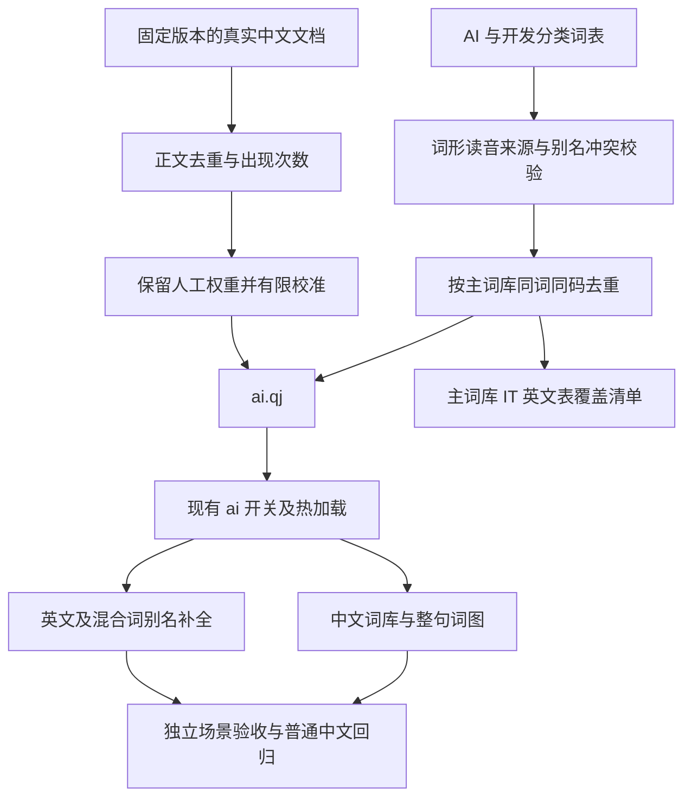

# AI 与软件开发词库

面向日常 AI 辅助编程：中文技术和项目表达、工具与框架名称、配置文件和中英混合词都应能整块输入。
领域 ID 继续为 `ai`，已有开关保持兼容；显示名称更新为「AI 与软件开发」，默认关闭。

## 数据边界与覆盖

- AI 数据：基础算法、训练、模型、智能体、向量、检索、厂商和型号。
- 开发数据：复用现有 IT 词库的适用词，补充现代语言框架、包管理、测试、部署、桌面移动端与项目协作。
- 项目专名：通过已有本地词库导入和开关管理。内部模块名、服务名、业务实体不得自动汇入随包词库。

源词条分类维护，共 8,279 条；不是每条都算新增，生成时只与始终加载的主词库去重。可选 IT 词库默认关闭，保留与它的重叠以保证独立启用。
开发词表包含 AI 辅助编写、规则筛选和读音修订；不把条数当作完成标准。

## 数据流程

`terms.tsv`、`names.tsv`、`domains/*.tsv` 通过同一生成器，格式与来源见 [词库源](../../assets/lexicon/ai/README.md)。
语料含教材、Vue 和 Rust 中文正文，保留固定提交、归档 SHA256、完整许可证和逐段出处。`tools/corpus/development.py` 可从本地归档重建开发正文，不联网。
中文按非重叠子串、英文按 ASCII 标识符边界计数，段落跨文件去重。人工权重与真实次数分列记录；最终词级权重取人工值与封顶 200 的次数的较大值。
该次数不是分词后的通用一元概率；不自动替换全局 bigram 模型。

生成覆盖报告 `ai-coverage.tsv`，区分主词库同词同码、可选 IT、主英文表、英文同码其他词和本次加入状态；参考表缺失写 unknown。
生成源中的重复词码、同码不同别名和非法来源在写文件前失败；导出容器和文本使用原子文件替换。

## 输入语义与排序

中文使用规范全拼，复用全拼、简拼、双拼及繁体输出。

英文与新式混合词使用专用 `@` 键，不进入拼音词图：
- 默认码由名称去标点、空格并转小写得到；如 `package.json / @packagejson`。
- 显式别名如 `C++ / @cpp`、`C# / @csharp`、`GOWORK / @goworkenv`。
- 混合词如 `Git分支 / @gitfenzhi`、`API接口 / @apijiekou`。
- 同词多码允许；同码不同词在生成阶段拒绝。跨导入词库碰撞保留加载顺序并写警告，不记录内部项目词形。
- 旧式 `AI模型 / ai mo xing` 的拼音和双拼行为不变。新式别名不自动转换为双拼，五笔保留原有模式规则。

`WordList::from_dictionaries` 提取标记词条；`Engine::set_extra_dictionaries` 统一重建领域名称表并失效查询缓存。
未标记的普通导入词不改变语义。同一显示词的多个别名在补全时只占一个候选位置。

英文模式保持精确匹配优先、补全其次、纠错最后。补全先看个人选择次数，再优先启用的领域表，最后按同表静态权重排序，避免几十分的领域人工权重被主英文表的 Zipf 千分值挤出。
未启用领域表时维持原有排序；中文模式沿用既有中英混输优先级。关闭词库撤销其中文与英文候选，但不删除用户已学词或其他表已有的词。

## 发布与维护

三平台复用已有目录枚举、热加载、`dicts/*.qj` 打包及 `LICENSE.*` 文件复制，无新增平台壳排序逻辑。
数据包脚本同时传入教材与开发正文；新数据包正式发布后才会进入发行版。更新代码不等于安装或发布。

具体项目词表可使用本地 TSV：中文拼音键或英文/混合词 `@` 别名键，手动导入并独立开关。无需新增项目自动扫描服务。

## 验收

`tools/eval/development/acceptance.tsv` 为独立编写的 164 个任务用例，覆盖需求、架构、排障、测试、Git、数据、前端、桌面、部署、代理、工具、文件与混输。
中文/混合词前 5 命中率目标 ≥95%，必备英文与文件名全部达到各自位置要求；80 条普通中文首选须保持稳定。
`run.py` 可比较无领域词库或上一版 AI 词库，输出候选、命中率、普通中文差异及完整输入查询耗时；逐键性能另用 CLI `--typing` 验证。
别名碰撞、非法码、上屏消耗、关闭撤销、个人习惯、旧 AI 混合词兼容由 Rust 测试覆盖。

当前语料仍不能代表所有业务和工具，验收集也是有限样本；CLI 结果不能替代真实 IMK/TSF/IBus 输入验收。
